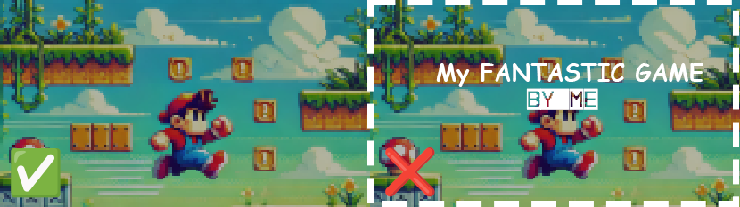
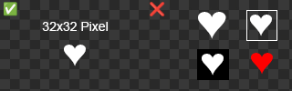

# Trash Galore 3 - Der Leitfaden

Damit du dich auf die Entwicklung deines Spiels konzentrieren kannst habe ich mir Mühe gegeben, das Drumherum möglichst einfach zu gestalten. Ein paar Dinge gibt es trotzdem zu beachten, die ich im Folgenden kurz anspreche.

# Constraints
* Bitte kennzeichne alle Ressourcen mit einem Präfix, wie `obj_abc_enemy` oder `spr_abc_apple` damit diese eindeutig sind.
  * Das gilt auch für globale Variablen und Funktionen sowie Structs die in Scripts definiert werden.
  * Die mitgelieferten Dateien `game.json` und `scr_api` sollten nicht umbenannt werden
* Es gibt keine harten Vorgaben zur Sprache. Du kannst dein Spiel aber für Lokalisierung vorbereiten, falls diese später implementiert wird, [siehe hier](#lokalisierung)
* Der Launcher bietet bereits Einstellungen zu Auflösungen, Fullscreen und Lautstärke. **Baue bitte keine eigenen Möglichkeiten, diese Werte zu ändern.**
* Der Launcher zeigt bereits ein Hauptmenü für dein Spiel an, bestehend aus "Start", "Beschreibung" und "Achievements". **Überlege dir bitte, ob du wirklich ein eigenes Hauptmenü brauchst, bevor du eines einbaust.**
* Die Ziel-Auflösung des Launchers ist 640 * 360. Dieser bietet allerdings die Möglichkeit die Anzeige zu skalieren. Für dein Spiel kannst du dir also eine der folgenden Auflösungen aussuchen:
  * 320 * 180
  * 640 * 360
  * 1280 * 720
  * 1920 * 1080
  * 2560 * 1440
  
  Möchtest du eine Auflösung nutzen, die von 640 * 360 abweicht, führe beim Start deines Spiels bitte
  ```javascript
  surface_resize(application_surface, 1280, 720); // Deine Auflösung
  ```

  Sollen die Pixel weich interpoliert werden nutze zusätzlich:
  ```javascript
  gpu_set_texfilter(true);
  ```

  Beim Nutzen von Funktionen wie `window_get_height` solltest du außerdem darauf achten, dass das Fenster durch die Skalierung eine Variable Größe hat.
* Der Launcher enthält bereits eine Pause-Funktion mit einem Menü. Das musst du nicht selbst bauen. **Dadurch ist die Escape-Taste (bzw. `INPUT_ACTION.UI_QUIT`) bereits belegt und sollte von dir nicht mehr genutzt werden.**

# Development Package
Es gibt ein Package, das du zur Entwicklung importieren musst. Du kannst es [hier](
https://raw.githubusercontent.com/Moolt/trash-galore-3-dev/refs/heads/master/trash-galore-3-dev.yymps) herunterladen. Im GameMaker kannst du es über `Tools -> Import Local Package` importieren.
Es enthält folgende Dateien:

## scr_api.gml

Stellt die Api bereit, um mit dem Launcher zu kommunizieren.
Die Funktionen lassen sich über `API.` aufrufen und sind über JSDoc dokumentiert. Der GameMaker zeigt dir also an, wie die Funktionen zu nutzen sind.

Einige Funktionen sind erst vollständig implementiert, sobald dein Spiel im Launcher integriert wird. Wundere dich also nicht, dass z.B. das Freischalten von Achievements nur eine Debug-Nachricht loggt.

Beispiel:
```javascript
API.unlock_achievement("abc_great_success");
```

### Spielstand speichern und laden
Die Api stellt einige Funktionen bereit, um den Spielstand zu speichern und zu laden.

```javascript
API.write_number("My great game", "my_number", 123);
API.write_string("My great game", "my_string", "Hello world!");
API.write_boolean("My great game", "my_boolean", true);

show_debug_message(API.read_number("My great game", "my_number"));
show_debug_message(API.read_string("My great game", "my_string"));
show_debug_message(API.read_boolean("My great game", "my_boolean"));
```

### Steuerung
Über die Api können wir auch die Steuerung vereinheitlichen, sodass im besten Fall auch Controller-Support mitgeliefert wird. Nutze dafür gerne die mitgelieferten Funktionen, auch wenn dies streng optional ist:

Beispiele:
```javascript
API.action_check_pressed(INPUT_ACTION.UI_NAVIGATE_UP);
API.action_check_released(INPUT_ACTION.MOVE_UP);
API.action_check(INPUT_ACTION.ACTION_PRIMARY);
```

### Audio
Die Musik- und Sound-Lautstärke lässt sich im Launcher einstellen.
Wenn du Sounds abspielst, dann tu das am besten über die mitgelieferten Funktionen:

```javascript
API.play_sound(snd_abc_crash);
API.play_music(bgm_abc_ambient);
```

Für jede `play_`-Methode im GameMaker gibt es in der Api ein Gegenstück jeweils für Sounds oder Musik, welche die globale Lautstärke übernehmen.

Alternativ kannst du über die Api auch einfach auf die Lautstärke zugreifen:

```javascript
audio_play_sound(bgm_abc_ambient, 1, false, API.audio_get_music_volume());
audio_play_sound(snd_abc_crash, 1, false, API.audio_get_sound_volume());
```

Das ist allerdings nicht empfohlen, da Änderungen an der Lautstärke in diesem Fall nicht in Echtzeit übernommen werden.

**Achtung**: Bitte verzichte auf die Nutzung von Audio Groups, da diese in Packages nicht exportiert werden.

### Lokalisierung
Lokalisierung wird es vielleicht gar nicht geben, aber falls es doch nachgereicht wird, kannst du dein Spiel bereits darauf vorbereiten, indem du die `API.localize` und `API.localize_args` Methoden nutzt.

Auch wenn die Fallback-Werte laut Api optional sind ist es wichtig, dass du diese setzt, bis die Lokalisierung umgesetzt ist.

```javascript
API.localize("distinct_identifier", "Fallback Text"); // Gibt "Fallback Text" zurück
API.localize("moo_menu_navigate_back", "Zurück"); // Gibt "Zurück" zurück
API.localize("some_key"); // Gibt "" zurück, da Lokalisierung noch nicht implementiert ist

API.localize_args("player_status", [_health, _mana], "The player has {} health and {} mana left."); // Gibt z.B. "The player has 98 health and 23 mana left." zurück
```

## game.json
Die `game.json` landet in den "Included Files". Im Projektverzeichnis entspricht das dem `datafiles` Ordner.

Die `game.json` enthält alle notwendigen Metadaten, damit dein Spiel später richtig im Launcher angezeigt wird:

```json
{
    "name": "Name des Spiels",
    "author": "Dein Name",
    "description": "Eine kurze Beschreibung deines Spiels",
    "start_room": "room_moo_game_00", // Der Raum, den der Launcher aufrufen soll
    "images": ["spr_moo_thumb_00"], // Screenshots deines Spiels, die im Launcher angezeigt werden sollen.
    "achievements": [
        {
            "id": "aa_legendary",
            "name": "Legendary Status",
            "description": "Achieve a level of greatness that is truly legendary!",
            "hidden": true // Optionaler parameter. Versteckt das Achievement in der Liste der Achievements.
        },
        {
            "id": "aa_treasure_hunter",
            "name": "Treasure Hunter",
            "description": "Uncover all hidden treasures in the game!",
            "image": "spr_moo_achievement_icon_paint" // Optionaler Parameter: Ein Icon, das im Launcher zusammen mit dem Achievement angezeigt wird.
        }
    ]
}
```

### Thumbnails / `images`

Die Thumbnails sollten keine Schrift, kein Logo und keinen Rahmen enthalten. Die Thumbnailauflösung ist 640 x 360.

<p align="center">
  
</p>

### Achievements
Für die Icons der Achievements gibt es ein paar Einschränkungen. Bei Unklarheiten bitte nachfragen.

* Transparenter Hintergrund
* Auflösung von 32 x 32 Pixel
* Einfarbig und weiß
* Ohne Rahmen
* 3 Pixel Abstand in jede Richtung (Padding)



# Deployment

## Export
Um das Spiel in den Launcher zu integrieren musst du es bitte über `Tools -> Create Local Package` exportieren. ❗ Bitte achte nochmal darauf, dass alle Ressourcen mit Präfixen versehen sind.

Hinten raus kommt eine `.yymps`-Datei.

## Testen
Bevor du dein Spiel einreichst, teste es bitte vorher einmal im Launcher.
Lade den Launcher dafür [hier](https://github.com/Moolt/trash-galore-3/archive/refs/heads/master.zip) herunter. 

Öffne das Projekt und importiere dein Package über `Tools > Import Local Package`. `scr_api` bitte nicht überschreiben.

Kopiere anschließend den Inhalt deiner `game.json` in das Array in der `games.json`.

Dann kannst du den Launcher starten.

## Upload

Lade die `.yymps`-Datei jederzeit auf [https://filebrowser.moolt.de](https://filebrowser.moolt.de) hoch.

Die Zugangsdaten sind:

| Nutzername  | Passwort                      |
| ----------- | ----------------------------- |
| trashgalore | Auf Anfrage                   |


Zum Ersetzen klappt am Besten Drag & Drop.

Durch den Upload wird ein GitHub-Workflow angestoßen, der automatisch den Launcher mit deinem Spiel für Linux, Windows und HTML5 baut. Falls du zum GitHub-Repository eingeladen werden möchtest, melde dich gerne bei mir (Moolt).